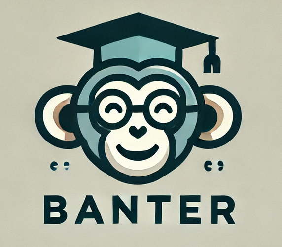

<p align="center">
  
  <br/>
  <span style="font-size: 2em; color: gray; vertical-align: middle;">A Way To Learn To Think Algorithmically</span>
</p>

##

Banter is a language based off pseudocode, to help enforce basic programming concepts like assignment, conditionals, and repetition.

The language is structured off a [simple grammar](https://augustine.myusa.cloud/perugini/AveMaria/teaching/courses/csci151/LectureNotes/pseudocodeLanguage.html) designed by [Dr. Saverio Perugini](https://saverio.carrd.co/) to teach these concepts to introductory students.


The reader may well say, "Just use Python, bro?"

Well, bro, there a number of reasons why a student's learning experience could be tainted by a language like Python. 

The primary reason is that Python is a "hodgepodge of a language" and tries to be too many things at once. 

Students often will miss the entire point of an assignment designed to help them think algorithmically, focusing instead on some shiny and obscure "syntactic sugar", of which Python is chock-full. 

For instance, Banter limits arithmetic operations to those between the same type, avoiding weird statements like \
`"Hello" * 100`, or other confusing lines like `[y for x in [[1, 2], [3, 4]] for y in x]`. 

Banter removes these dangerous pitfalls by providing a language stripped of any juicy language features, leaving a simple set of instructions to help new students formulate their ideas into mechanical procedures, which is "the core of computational thinking".

# Basic Syntax

If you're already familar with programming, you might find Banter mildly infuriating. There are no loops, no functions, and only primitive data types. The whole language can be broken down into five basic rules. While this may be limiting for building enterprise software, it is actually quite liberating for the mind of a student.

## 1. Let Statements

The Let Statement allows you to assign the output of an expression to a particular mneumonic representation. 


Syntax -> `let <mneumonic> be <expression>`

Examples:

```
let x be 5
let interest_rate be 0.14
let x be x + 1
let ratio be (x + 5 / interest_rate)

return ratio
```

## 2. If Statements

The If Statement allows you to conditionally execute a line of code. The body of the statement will only execute if the expression evaluates to True.


Syntax -> `if <comparison expression>, then <statement(s)>`

Examples:

```
let a be 1

if a + 6 > 7, then
    let limit be "not too far"

if a - 6 <= 7, then let limit be 2.17

return limit
```

## 3. If-Else Statements

The If-Else Statement simply provides alternative execution case for when the condition from an If statement evaluates False. 


Syntax -> `If <comparison expression>, then <statements(s)> else <statement(s)>`

Examples:
```
let a be "not too far"
let speed be 60
let score be 73

if limit != "not too far", then
    if speed == 60, then
        let score be 7009.56
else
    let answer be score - 75

return score
```


## 4. Return Statements

Return statements are used to simply return the value of a statement or expression and terminate the evalutation. These statements cannot be null, you must return something.


Syntax -> `return <mneumonic>`

Examples:
```
let wrong be 3
let right be 7

if wrong + wrong == right, then 
    return True
else
    return False

return "this will never execute"
```

## 5. Goto and Marker Statements

Goto Statements allow for continuous loops of instructions demarcated by Marker Statements.

Marker Syntax -> `@ <digit>`

Goto Syntax -> `goto instruction <digit>`

Examples:

```
let x be 0
let n be 100

let a be 0 
let b be 1

@1 # Print Factorial Numbers
if x < n, then
   print a

   let temp be a + b
   let a be b
   let b be temp

   let x be x + 1

   goto instruction 1
```

Here's an example that's a litte more complex (you can view more in the examples/ folder).

```
### Print Evens

let x be 1

@1 # Main Loop
if x < 11, then
   let even be False
   goto instruction 2

   @ 1.1
   if even == True, then
      print x

   let x be x + 1

   goto instruction 1

else return "END"

@2 # Check If Even
let y be x

@2.1
if y > 0, then
   let y be y - 2
   goto instruction 2.1

if y == 0, then 
   let even be True

goto instruction 1.1
```

## Additional Syntax

As demonstrated in the previous example, variables and expressions can be printed to the screen using\
`print <expression>`, which simple displays the value without terminating the program. 

Unlike `return`, `print` statements can be null, which print a new line.\
Additionally, comments, can be written using the `#` symbol.

# Using Banter

The interpreter gives user the ability to interact with a banter program live in an "interactive" mode, as well as regular execution of a script. 

Pass a file to the interpreter using `./main file.banter` 


To remain in interactive mode, add the `-i` flag -> `./main -i file.banter`
